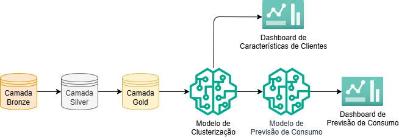

# ⚡ Consumo Energético

**previsão de consumo energético residencial** e **segmentação de clientes**



---

## 🧩 Visão Geral

Este repositório contém:

- 📊 Análise Exploratória de Dados (EDA)
- 🏗️ Pipeline ETL com DuckDB (camadas bronze, silver e gold)
- 🤖 Modelos de:
  - Clusterização de Clientes
  - Previsão de Consumo Energético
- 🧪 Comparação de Modelos
- 📈 Dashboards Interativos com Dash
- 🧬 Versionamento de modelos com MLflow

---

## 🚀 Como Executar o Projeto

### 1️⃣ Criar e ativar o ambiente virtual

Abra um terminal (CMD, PowerShell ou terminal VSCode) e execute:

```bash
python -m venv venv
venv\Scripts\activate

💡 No Linux/Mac: source venv/bin/activate
```

### 2️⃣ Instalar dependências
Com o ambiente ativado, instale os pacotes necessários:

```bash
pip install -r requirements.txt
```

### 3️⃣ Iniciar o servidor MLflow
Antes de treinar modelos, é necessário iniciar o servidor local do MLflow para versionamento:
```bash
mlflow server --host 127.0.0.1 --port 8080
```

⚠️ Atenção com o DuckDB
O DuckDB não permite múltiplos notebooks escrevendo no mesmo arquivo simultaneamente.
Sempre reinicie o kernel do notebook ao alternar entre notebooks no VS Code.

🧪 Execução do Pipeline
Você pode executar o pipeline de duas formas:

✅ Opção 1: Execução automática
Com o ambiente ativado, basta rodar:
```bash
python notebooks/run.py
```

🛠️ Opção 2: Execução manual
Siga rigorosamente a ordem abaixo para garantir a integridade dos dados e dos modelos:

1. Criar o banco de dados
```bash
notebooks/ETL/camada_bronze.ipynb
notebooks/ETL/camada_silver.ipynb
notebooks/ETL/camada_gold.ipynb
```
2. Treinar modelo de clusterização de clientes
```bash
models/clusterizacao_cliente/feature_engineering.ipynb
models/clusterizacao_cliente/train.ipynb
models/clusterizacao_cliente/inference.ipynb
```
3. Treinar modelo de previsão de consumo energético
```bash
models/previsao_consumo/feature_engineering.ipynb
models/previsao_consumo/train.ipynb
models/previsao_consumo/inference.ipynb
```

📊 Dashboards
Os dashboards podem ser executados após o treinamento dos modelos.
Eles utilizam as tabelas geradas e os resultados dos modelos para visualização interativa.

EDA e Avaliação de Modelos
- A análise exploratória pode ser acessada e executada isoladamente:
```bash
notebooks/EDA.ipynb
```

- Os notebooks teste_modelos.ipynb, localizados nas pastas de modelos, contêm comparações de diferentes algoritmos para escolher o melhor para cada tarefa.

📁 Estrutura do Projeto (resumida)
```bash
├── data/
├── notebooks/
│   ├── EDA.ipynb
│   ├── run.py
│   └── ETL/
├── models/
│   ├── clusterizacao_cliente/
│   └── previsao_consumo/
├── requirements.txt
├── README.md
```
